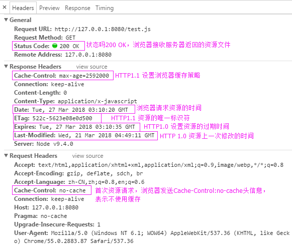
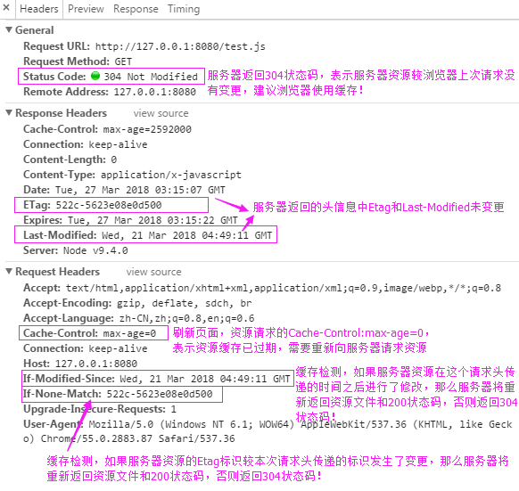
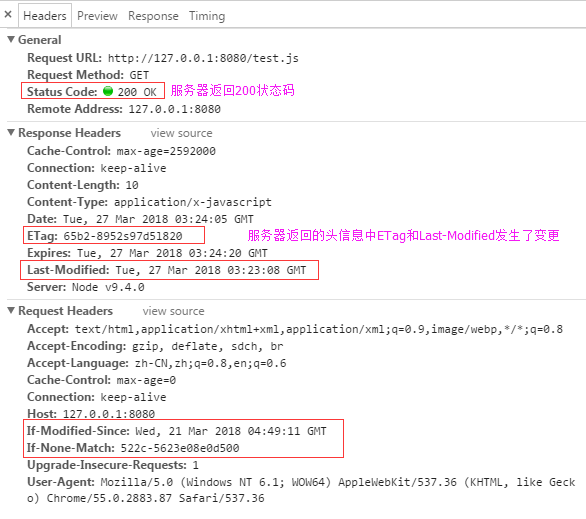
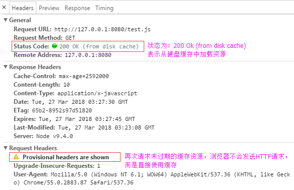
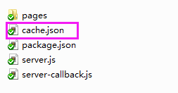

# 浏览器缓存策略

## HTTP头信息

首先我们从资源被请求时，请求行为和资源缓存的不同来看下HTTP头信息的表现：

资源的首次请求：

页面刷新-资源缓存未过期：

页面刷新-资源缓存已过期-资源未变更：

页面刷新-资源缓存已过期-资源已变更：

资源被再次请求时-缓存未过期：

## 缓存策略

当浏览器请求资源文件时，默认会将源资文件缓存到本地以便重复使用，加快网页的加载速度。

浏览器的资源缓存分为 `from disk cache` 和 `from memory cache` 两类。当首次访问网页时，资源文件被缓存在内存中，同时也会在本地磁盘中保留一份副本。当用户刷新页面，如果缓存的资源没有过期，那么直接从内存中读取并加载。当用户关闭页面后，当前页面缓存在内存中的资源被清空。当用户再一次访问页面时，如果资源文件的缓存没有过期，那么将从本地磁盘进行加载并再次缓存到内存之中。

服务器可以通过Response Headers使用 `expires` 和 `cache-control` 设置一个有效的过期时间，当浏览器再次请求资源时会判断本地缓存是否已过期：

1. 如果没有过期那么直接从本地缓存读取，不会产生http请求，此为 **强缓存**。
2. 如果已过期，那么浏览器将重新向服务器请求资源，这一过程往往伴随着 **缓存检测**。

### expires

这是HTTP1.0版本的产物，属于 Response Headers，使用一个UTC格式的日期时间字符串表示资源的过期时间。

使用 `expires` 设置的过期时间是以服务器时间为准的，它可能跟浏览器时间不一致，不同时区也会存在影响。

### cache-control

这是HTTP1.1版本的产物，属于 Response Headers，提供更多详细的缓存策略，可以根据三种不同性质通过逗号进行组合使用:

1. 是否不使用缓存： `cache-control: no-store/no-cache/must-revalidate` ；
2. 是否为私有缓存： `cache-control：public/private`；
3. 设置过期时间: `cache-control: max-age/s-maxage`；

是否不使用缓存：

1. `must-revalidate` : 当本地的资源缓存没有过期前，使用本地缓存；当本地资源缓存已过期时，需要进行缓存检测（默认值）。
2. `no-cache` : 不管本地的资源缓存是否过期，都需要进行缓存检测。
3. `no-store` : 禁止浏览器缓存资源，每次请求资源都去服务器重新下载。

是否为私有缓存：

1. `public` ： 公共缓存，表示浏览器和代理服务器都可以设置缓存（默认值）。
2. `private` ： 私有缓存，仅浏览器设置缓存。

设置过期时间：

1. `max-age`：使用 `cache-control: max-age=60` 的形式表示本地缓存的资源将在xx秒之后过期，单位为秒，会覆盖 `Expires` 的设置。
2. `s-maxage` : 使用方式同 `max-age` ，在public设置下有效，针对共享缓存（代理服务器）有效。

使用 `max-age` 的优点在于设置的过期时间是一个相对于浏览器的时间，不受服务器和浏览器时间不一致的影响，也不会因为时区的不同而受到影响。

### 启发式缓存

当资源文件的 Response Headers 中带有 last-modified 字段，但是却缺少 `expires` 和 `cache-control` 用来表示资源缓存的过期时间的字段，这个时候浏览器会使用启发式缓存来确认该资源缓存的过期时间：

浏览器会根据 `date` 和 `last-modified` 之间的时间差值的10%来作为资源缓存的过期时间。

## 缓存检测

当浏览器重新向服务器请求资源时，如果原先的 Response Headers 中存在 `last-modified` 或者 `etag` 信息，那么在 Request Headers 中会通过 `if-modified-since` 和 `if-none-match` 将之前的信息带给服务器进行检测。如果服务器资源相对于本地的资源缓存没有发生变更，那么将会返回304状态码，表示资源未更新，让浏览器使用本地的资源缓存，这就是 **协商缓存**。

如果原先的 Response Headers 中没有 `last-modified` 和 `etag` 信息，那么将从服务器重新下载资源文件。

### last-modified 和 if-modified-since

这两个字段都是HTTP1.0版本的产物。

1. `last-modified`: 属于 Response Headers，表示资源最后一次修改的时间。

2. `if-modified-since`: 属于 Request Headers，用来判断服务器端资源是否在该传递的时间之后做了修改，如果没有修改那么服务器将返回304状态码，让浏览器使用资源缓存。

### etag 和 if-none-match

这是HTTP1.1版本的产物。

1. `etag`: 属于 Response Headers，表示资源的唯一标识，由服务器端生成，通常是资源内容和修改时间组合的md5 hash字符串。

2. `if-none-match`: 属于 Request Headers，用来判断服务器资源是否与该传递的标识不一致，如果一致则表示资源文件没有修改过，服务器将返回304状态码，让浏览器使用资源缓存。会覆盖 `if-modified-since` 的设置。

使用etag来判断服务器端资源文件是否做了修改，主要有以下考虑：

1. `last-modified` 只能精确到秒，而有些服务器资源可能在1秒内进行了多次修改。
2. 服务器资源文件，有些会定时自动生成，但是文件内容并没有发生任何变更。

## 用户行为

浏览器的缓存策略还跟用户的行为有关：

1. 当用户从url地址栏回车访问网页时，强缓存和协商缓存都有效。
2. 当用户从页面中点击一个超链接访问网页时，强缓存和协商缓存都有效。
3. 当用户按F5刷新时，强缓存将无效，但会触发协商缓存。不过在Firefox浏览器中，强缓存和协商缓存均无效。
4. 当用户按Ctrl+F5强制刷新时，强缓存和协商缓存都将无效，浏览器将向服务器重新并下载资源文件。

## demo检验

为了彻底搞清楚浏览器的缓存策略，这里提供了一个使用node http模块构建的一个简单服务器环境，通过自行设置Response Headers来预览浏览器缓存的表现行为。点击[下载资源包](http://www.fedlife.cn/base-Http/browser-cache/node-server-cache-demo.zip)。

下载资源包后，自行解压，然后使用 `npm install` 命令安装依赖，通过 `node server` 执行目录下的server.js文件来启动本地服务，将会自动使用默认浏览器打开目录下的 `/pages/index/index.html` 页面。

之后可以在cache.json配置文件的下图所示的代码中，对浏览器缓存涉及到的四个http字段进行编辑，修改完毕后保存并强制刷新浏览器页面即可：

编辑说明：

1. 设置相关字段为false，则表示不设置相应的http字段；
2. 对于Cache-Control字段的值，填写其支持的策略组合即可；
3. 对于Expires字段的值，按秒填写数字即可；
4. 对于Etag和Last-modified字段的值，设置为true即可；

## 参考资源

1. [彻底理解浏览器缓存机制](https://www.cnblogs.com/shixiaomiao1122/p/7591556.html)
1. [透过浏览器看HTTP缓存](http://www.cnblogs.com/skylar/p/browser-http-caching.html)
1. [浏览器缓存机制剖析](https://mp.weixin.qq.com/s/yf0pWRFM7v9Ru3D9_JhGPQ)
1. [彻底弄懂 Http 缓存机制 - 基于缓存策略三要素分解法](https://my.oschina.net/bugly/blog/808433)
1. [web性能优化之：no-cache与must-revalidate深入探究](https://segmentfault.com/a/1190000007317481)
1. [由memoryCache和diskCache产生的浏览器缓存机制的思考](https://segmentfault.com/a/1190000011286027)

